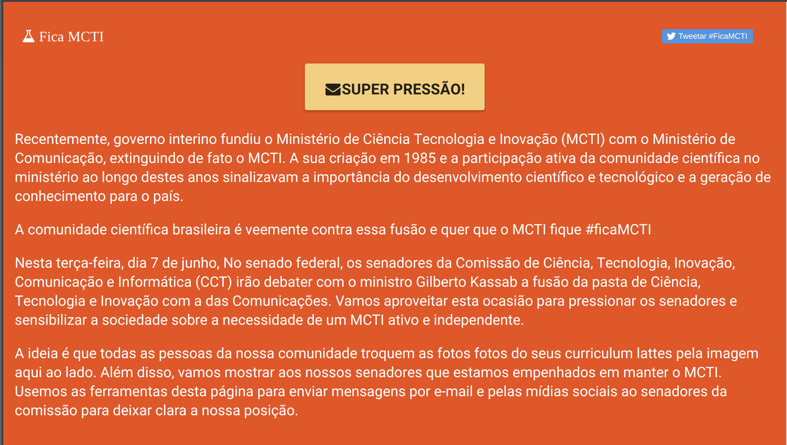

# Fica MCTI

Ferramenta de pressao sobre parlamentares

# capturas

O Ministério da Ciência, Tecnologia e Inovação representou, nos últimos anos, uma visão sobre o desenvolvimento do Brasil, na qual o processo de desenvolvimento científico e tecnológico esteve associado à produção de conhecimento. A democratização do conhecimento e sua relação com a inovação são os campos férteis para nos tornarmos uma sociedade do século XXI.

A extinção do MCTI  traz o risco da perda da força dessa visão, na qual um sistema de inovação e produção de conhecimento, relacionado ao desenvolvimento de novas tecnologias, produtos e serviços, deve ser prioridade. O sucesso da comunidade científica diante da crise do vírus zika mostra que a ciência e a tecnologia atuam de forma articulada com a sociedade e suas necessidades. O Ministério das Comunicações tem atribuições de garantia de acesso e regulação que não têm nenhuma conexão com o campo da ciência e tecnologia, sendo a fusão proposta uma desqualificação das políticas de ciência e tecnologia para o desenvolvimento do país.

#FicaMCTI, inspirado e baseado no Mapa da Democracia, é uma ferramenta de pressão online n@s parlamentares que compõem a Comissão de Ciência, Tecnologia, Inovação, Comunicação e Informática no Senado Federal.
